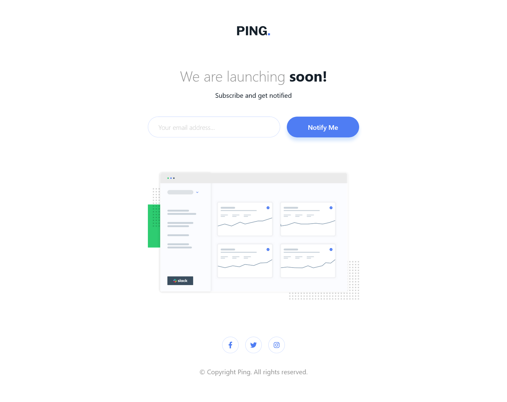

# Ping Coming Soon Page


## Links
- [Challenge Link](https://www.frontendmentor.io/challenges/ping-single-column-coming-soon-page-5cadd051fec04111f7b848da)
- [Site Preview](https://robinjmm-ping.netlify.app/)

## About
This is my solution for the challenge of building a Coming Soon Page for a fictional company called Ping. The challenge is from [Frontendmentor.io](https://www.frontendmentor.io).

I don't have much to say about this challenge. The layout was pretty simple, only a single-column layout. The form validation was simple, too, since there's only one form. The only real challenge is the layout and spacing between elements. It's not a pixel-perfect re-creation since I don't have access to the premium Figma files.

**Any feedback on how to improve my solution would be greatly appreciated.** 😊
## User Stories
The user should be able to:
- View the optimal layout for the site depending on their device's screen size
- See hover states for all interactive elements on the page
- Submit their email address using an input field
- Receive an error message when the form is submitted if:
    - The input field is empty
    - The email address is not formatted correctly

## Built With
- Semantic HTML5
- CSS3
- Flexbox
- Sass
- JavaScript

## Usage
You can download the project files by clicking on the green **Code** button, then select **Download Zip**.

Once you finish extracting, move into the project folder, open the terminal, and type the following code:

```
npm install
```

This will install all the required dependencies.

To compile Sass into CSS and watch for any future changes, type the following code in your terminal:


```
npm run sass
```

To compile Sass into a minified version of CSS, run:

```
npm run prod
```

## Acknowledgement
I'm very grateful to the people at [Frontendmentor.io](https://frontendmentor.io) for providing designs and challenges that help me improve my skills as a web developer.
